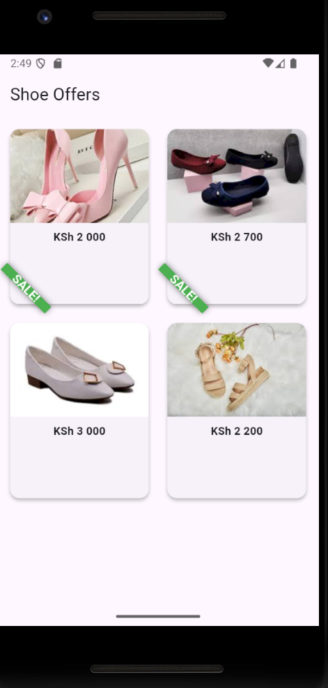

# flutter_banner_demo
# This a flutter project uses a banner widget found in a product card widget to display promotional message or a message that need attention.

# Getting started 
# How to run the project

1. Have flutter and an emulator installed on your machine.
2. Clone the repository on your machine.
3. Run the command 'flutter pub get' to fetch dependecies.
4. Finally run 'flutter run' to see the UI on the emulator.

# The key widget Properties

Message : This is the text shown on the UI 'SALE'
Colour  : The color around the ribbon which is green
Location: This is where the banner appears like the UI it is on the bottomStart
Text Style: This is the font style and font weight

# Preview
